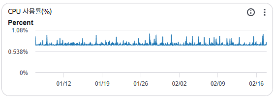
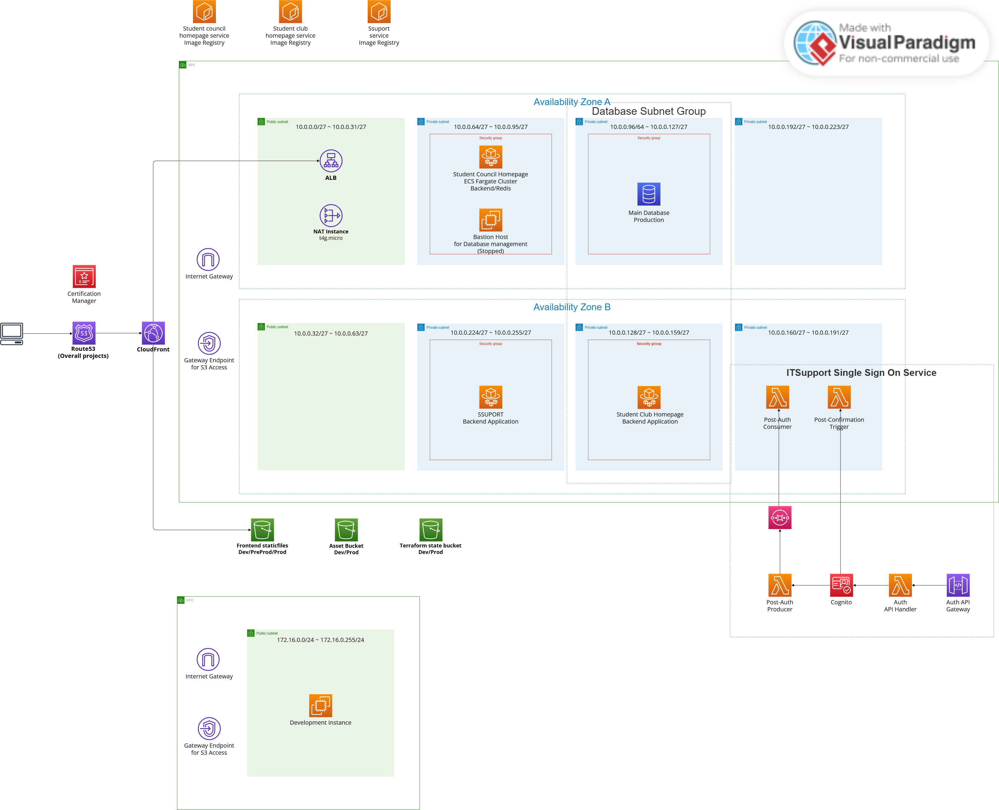

## Overview

Our current ITSupport AWS infrastructure has several problems. It has low availability, it costs too much, and the Terraform setup is old.
This document proposes technical solutions and a new AWS architecture to fix these issues.
Also, we must keep our AWS costs under `$150` per month.

> Update (2026-02-18): This post is a strategy/blueprint document.  
> In actual production rollout, ECS cost reduction observed in mid-February was a combined effect of ARM64 migration and service scaling changes, and should not be interpreted as Spot-only savings.

### Previous AWS Infrastructure


### Current Cost Evaluation

> As you can see, our old AWS infrastructure was not cost-effective. It costs more than `$150` per month, which is too expensive for us.


#### 1. Availability Issue

The old infrastructure had a Single Point of Failure (SPOF).
The production database was in only one Availability Zone (AZ) without a backup.
This means if that AZ goes down, our system goes down too.

#### 2. Scalability Issue

Our system did not have an Auto Scaling Group (ASG) for high traffic.
So, sudden traffic spikes could crash the system.
Before, we only focused on saving money, not on handling growth.

#### 3. Cost inefficiency

We did not use cost-saving plans for EC2 and RDS instances.
For example, production instances ran 24/7 at full price.
Also, some development computers used resources they did not need.

#### 4. Outdated Terraform project

We used Terraform to manage the infrastructure at first.
But it became hard to manage as our team's needs changed.
Managing and changing infrastructure took too much time.
This stopped us from focusing on building our applications.

## Solutions

### 1. Use Fargate on production environment

First, I decided to use AWS Fargate for production to make things easier.
Fargate lets our services run on their own and scales automatically when traffic is high.
It also keeps containers running correctly, similar to Kubernetes.
> I chose `Fargate` instead of `AWS EKS` because it is easier to learn and cheaper.
> As our service grows, we can move to EKS later for better management.

Second, I checked the CPU usage of our current student homepage.
I found that even with a t2.micro instance, usage is low.
So, I gave 0.5 vCPU and 1GB RAM per Fargate task.

### 2. Spot EC2 instances

Before, we used On-Demand instances without a plan.
To save money, I switched to Spot Instances for development.

**First**, I put multiple containers (Spring Boot for Student Council, Django for Club Homepage, etc.) onto one cheap t4g.medium Spot Instance. 
This gives us 2 vCPU and 4GB RAM for development at a much lower price.
I calculated the monthly cost for a `t4g.medium` spot instance in the Seoul region. For one month, it costs approximately `$0.0072 * 750 = $5.4` + `$0.0036 * 750 = $2.7` = `$8.1` per month.


**Second**, NAT instances must rarely stop. To improve speed and cost, I chose the t4g.micro instance. It has more vCPU and network speed than the t2.micro.
> (Ref: https://aws.amazon.com/ko/ec2/instance-types/t4/)

Also, our old t2.micro NAT instances were enough for our traffic. Our services are only for Soongsil University students, so our network traffic is not very high. As you can see in the image below, usage is low even with a t2.micro instance. So I combined all NAT instances into one t4g.micro instance.



**Third**, if AWS stops the spot instance, we need to make sure containers and data restart automatically. To do this, we create a Spot Instance with the `Permanent` option. This automatically requests a new instance if the old one stops. Also, the `Stop` policy keeps the instance ID and volume even if the instance stops. If the volume is safe, Docker can restart the containers automatically after the instance restarts. (We must set the `unless-stopped` restart policy for our containers. This makes sure the container restarts after the instance restarts.)

### 3. Remove development RDS for cost saving

Our development environment wastes money on RDS. We don't really need RDS for development. We are just a student council group, and our work doesn't need complex databases. So, I decided to remove the development RDS. Instead, I used a database in a container on the same EC2 spot instance.

> Actually, using a Spot instance for a database is not usually a good idea. But for us, saving money is more important than convenience, so it was a necessary choice.

To make the move, we need to copy our RDS data to the container database. Here is the plan I followed.

#### I. Dump development RDS data

I connected to our development RDS instance and dumped the data to a file in the EC2 spot instance.

```bash
mysqldump -u user -p --single-transaction --routines --events --databases db_name > dump.sql
```

`--single-transaction`: This keeps the dump consistent by locking the database during the process.
`--routines`: This includes stored procedures and functions.
`--events`: This includes scheduled tasks.
`--databases`: This specifies which database to dump.

We only needed the database called `db_name`, so I ran the command above.

#### II. Remove development RDS instance

To remove the RDS instance, I ran this command.

```bash
aws rds delete-db-instance --db-instance-identifier db_name --skip-final-snapshot
```

We didn't need a final snapshot because we already dumped the data to a file in the EC2 spot instance.

#### III. Migrate development RDS data into containerized database

I updated `docker-compose.yml` to define the containers to run in our EC2 Spot Instance like this.

```yml
services:
    db:
        image: database_image
        container_name: database_container_name
        environment:
            ENVIRONMENTS...: 1234
        volumes:
            - ./db:/var/lib/mysql
            - ./dump.sql:/dump.sql # This runs our dump.sql file on the first run. After success, we should remove it.
        and so on...:
```

#### IV. Create existing user in database container

We need to create the same user in the new database so the application can connect without changes.
So, in the database console, I created the user like this.

```bash
CREATE USER 'USERNAME'@'%' IDENTIFIED BY 'PASSWORD';
GRANT ALL PRIVILEGES ON DATABASE_NAME.* TO 'USERNAME'@'%' WITH GRANT OPTION;
FLUSH PRIVILEGES;
```

This lets the app connect without changing the database user.
However, we must update the connection details because the database moved to a container.

## Result

### Updated AWS architecture



### Availability evaluation

We improved availability, especially for our production environment.

#### Production

By using AWS Fargate, our application is now stateless and scalable. If traffic spikes, Fargate can add more tasks automatically. If a container fails, Fargate replaces it immediately. This allows us to handle more users without downtime.

#### Development

For development, we compromised slightly on availability to save money. Spot Instances may stop unexpectedly, but our Permanent request setting ensures they restart automatically. Since this is only for development, a short downtime is acceptable

### Cost comparison

When reporting cost results, use finalized Cost Explorer data (`Estimated = false`) and compare the same time window and service scope.
For the homepage backend, cost changes during migration should be read as mixed effects (architecture/runtime/desired count), not a single-factor result.
