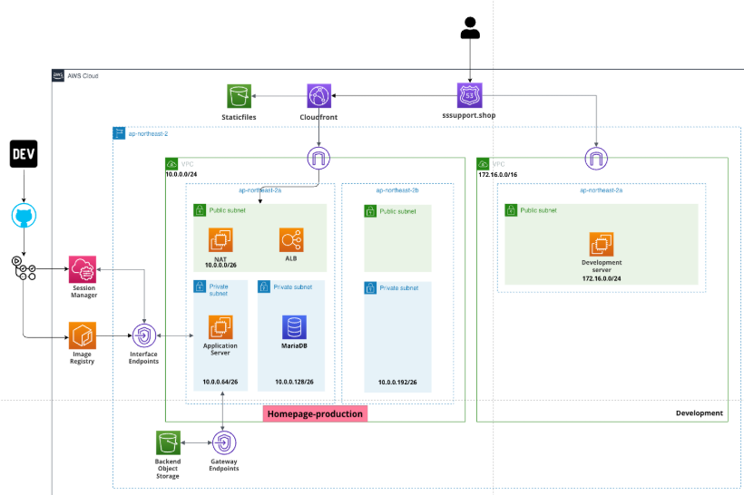
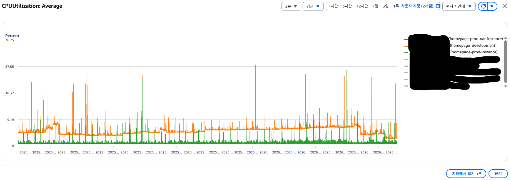
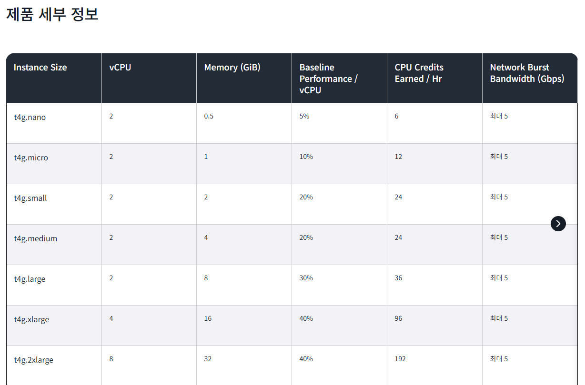

# Overview

The current ITSupport AWS infrastructure faces several challenges, including low availability, cost inefficiency, and an outdated Terraform configuration. 
This document proposes technical resolutions and a refined AWS architecture to address these issues.

## Previous AWS Infrastructure

### 1. Availability Issue
The previous infrastructure had a Single Point of Failure (SPOF). 
The production database was deployed in a single Availability Zone (AZ) without a backup or standby instance. 
This setup makes the system vulnerable to unexpected AZ outages.

### 2. Scalability Issue
Our production system lacked an Auto Scaling Group (ASG) to handle traffic spikes. 
Consequently, unexpected surges in traffic could lead to system downtime. 
Previously, the focus was solely on cost minimization rather than scalability.

### 3. Cost inefficiency
EC2 and RDS instances were not optimized for cost-saving plans. 
For instance, production instances were running 24/7 at full price, 
and some development/bastion hosts were running unnecessary resources.

### 4. Outdated Terraform project
Although Terraform was initially used to manage the infrastructure, 
it became difficult to maintain as the development team's needs evolved.
Managing, refactoring, and adding new infrastructure required excessive resources, 
often distracting from core application development tasks.

# Solutions

## 1. Use Fargate on production environment

First, I have decided to adopt AWS Fargate for the production environment to reduce operational overhead. 
Fargate allows our services to operate independently and automatically scale during traffic spikes. 
It also ensures that containers remain in a desired state, similar to Kubernetes' guarantees.
> I chose `Fargate` over `AWS EKS` to maintain a lower learning curve and reduce costs. 
> As the service grows, we can later consider migrating to EKS for higher management efficiency.

Second, I investigate our current student-homepage instance CPU utilization indicator.
After investigating the CPU utilization of our current homepage instances, 
I found that even with a t2.micro instance, utilization remains low. 
Therefore, I have allocated 0.25 vCPU and 1GB RAM per Fargate task. 
To further reduce costs, I plan to utilize a 1-year Savings Plan for the Fargate clusters.

Based on Seoul region I calculated for our production environment (per month)

| Services | State (Min ~ Max) | On-demand (Monthly) | 1-year Savings plan (Monthly) |
| :--- |:------------------|:--------------------|:------------------------------|
| Student council | 1 ~ 2 Tasks       | $9.78 ~ $19.56      | $7.70 ~ $15.40                |
| SSuport | 1 ~ 3 Tasks       | $9.78 ~ $29.34      | $7.70 ~ $23.10                |
| Student club | 1 ~ 2 Tasks       | $9.78 ~ $19.56      | $7.70 ~ $15.40                |
| **Total** | **3 ~ 7 Tasks**   | **$29.34 ~ $68.46** | **$23.10 ~ $53.90**           |

## 2. Spot and Savings plan on EC2 instances

Previously, On-Demand instances were used without a clear strategy. 
To improve cost-effectiveness, I have switched to Spot Instances for development environments 
and Savings Plans for NAT instances.

**First**, I decided to consolidate multiple containers (Spring Boot for Student Council, Django for Club Homepage, etc.) 
into a single, cost-effective t4g.medium Spot Instance. 
This provides a balanced 2 vCPU and 4GB RAM environment for development at a significantly lower the price.
Based on Seoul region, I calculated the instance monthly cost on `t4g.medium` spot instance.
For one month usage, it requires only `$0.0136 * 730 = $9.928`

**Second**, NAT instances must not be stopped for any reason. To improve throughput and cost-effectiveness, 
I chose the t4g.micro instance. It can handle more traffic than the current t2.micro, as shown in the image below.
> (Ref: https://aws.amazon.com/ko/ec2/instance-types/t4/)

Additionally, by using a Savings Plan for the t4g.micro instances, 
we can reduce costs even further compared to On-Demand pricing.
Below is the predicted cost for two NAT instances.
For one month usage, it requires only `$0.0072* 730 = $5.256`, the total price of two instances is about `$11`
(Please note that there is one more instance for the `PASSU` project, but it is not under my management.)
> (Ref: https://aws.amazon.com/ko/savingsplans/compute-pricing/)

For one month usage, it requires only `$0.0072* 730 = $5.256`, the total price of two instances is about `$11`

## 3. Standby RDS for production environment

## 4. Following best-practices on terraform project

### Using module on reusable resources

### ...

# Result

## Updated AWS architecture

## Availability evaluation

## Cost comparison

## Terraform project structure

## 