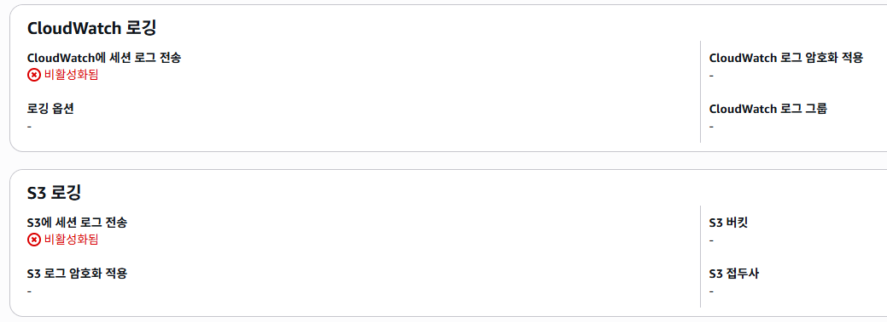

## Introduction

우리 학생 기구에서 개발/운영하는 서비스는 학생 PII를 다룬다. (이름, 학번, 학과, 학생회비 결제 여부)  
이게 아주 크리티컬한 금융/의료 데이터는 아니더라도, **개인 정보는 반드시 보호해야 한다.**

단순히 외부에서 DB로 직접 접근을 막는 것만으로는 충분하지 않고, 사고가 발생했을 때 **누가, 언제, 어떤 데이터에, 어떤 행위를 했는지**를 빠르게 파악할 수 있어야 한다.

때문에 이번 태스크로, SSM, S3, CloudWatch, CloudTrail을 활용하여 EC2/DB 접근 기록 및 실행한 명령어들의 기록을 남길 수 있는 아키텍쳐를 설계, 구현하려고 한다.

> 학생 조직의 현실(예산/인력/운영 난이도)을 고려해, 너무 과도한 설정보다는 최소한의 **Traceability**를 보장하며, 최소한의 비용으로 적절한 보안 수준을 만들어 내는 것을 목표로 한다.

---

## Goal

- 아키텍쳐 레벨에서 외부 직접 접근 차단은 이미 되어 있으므로 유지한다.
- 내부자(운영자/개발자) 행위에 대한 **Traceability**를 확보한다.
- 로그 비용을 폭발시키는 DB 레벨 general log/전체 감사는 지양한다.
  - DB 레벨에서는 Slow query log, Error query log 정도만 활성화하여 개발자가 이를 파악할 수 있도록 S3에 저장한다.
- S3에 로그 저장 시 절대 PII는 로그에 남기지 않는다.

---

## Current Architecture

### 3-tier Architecture

> Production 기준으로 다음과 같이 설계되어 있다.

- 외부 트래픽: CloudFront + ALB (80/443)
- 애플리케이션: ECS Fargate(Service)
- 데이터베이스: RDS, `publicly_accessible = false`
- RDS는 private subnet, 애플리케이션 계층에서만 접근이 가능하도록 Security Group이 구성되어 있다.

RDS는 다음과 같은 기본 설정이 활성화되어있다.

- `storage_encrypted = true` : 저장된 데이터를 암호화하여, DB가 유출되더라도 데이터를 보호할 수 있다.
- `deletion_protection = true` : DB를 삭제할 때, 추가적인 확인 절차를 거쳐 실수로 삭제하는 것을 방지한다.
- `backup_retention_period = 7` : 7일 동안 백업을 보관한다.

### Database Access Path

- DB SG는 애플리케이션 계층으로부터의 통신만 허용되어있는 상태이다.
- 모든 EC2 인스턴스는 SSH 포트가 비활성화 되어있는 상태이고, SSM Session Manager 기반으로만 운영되고 있다.

---

## Problems

- SSM 세션 로그 및 DB 접근/조회/변경에 대한 기록이 전무하다.

## Solutions

### 1. Dev 환경 접속 최소화

- Development 환경은 CloudFront 배포를 위해 Public subnet에 노출되어 있다. 때문에 외부로부터의 접근은 앱 포트를 제외하고는 모두 Security Group 설정을 통해 차단해주었다.
- 또한, Docker compose로 실행되는 데이터베이스의 경우 단순히 `ports` 설정을 통해 (보안그룹을 통해 막아두었지만) 외부로부터 누구나 포트 번호를 통해 들어올 수 있는 상태였다. 이를 localhost 및 컨테이너 네트워크 접근만 가능하도록 설정을 수정해주었다.
- Development EC2는 SSH로 접근이 불가능하도록 설정되어 있으며, 개발자는 반드시 SSM을 통해 접근하도록 구성되어 있다. 만약, 개발자가 개발용 데이터베이스에 접근해야 하는 경우 SSM Session Manager Port Forwarding 기능을 사용하도록 권장하였다.

  ```bash
  aws ssm start-session --target 개발EC2인스턴스ID --document-name AWS-StartPortForwardingSession --parameters "portNumber=데이터베이스포트번호,localPortNumber=로컬에서접속할포트번호"
  ```

#### 2. 데이터베이스 권장 계정 정책 설정

- 서비스 운영용 계정
  - 총학생회 홈페이지 서비스의 경우에는 `backend` 라는 테이블의 CRUD 작업을 수행해야 하므로, 해당 계정에 대한 권한을 다음 명령을 사용하여 설정해주었다.

  ```sql
  GRANT SELECT, INSERT, UPDATE, DELETE ON backend TO '서비스용계정'@'%';
  ```

---

### 2. SSM Session Manager Logging

- 우선 SSM Session Manager를 통해 접근하는 경우, 반드시 로깅을 통해 사용자가 어떤 행위를 수행하였는지 기록해야 했다. AWS에서는 이를 위해 SSM 사용에 대한 접근 기록을 CloudWatch Log와 S3 버킷에 저장하는 기능을 제공한다.
  
- CloudWatch 로깅의 경우, 실시간으로 접근 기록을 확인할 수 있다는 장점이 있지만, 비용이 발생한다는 단점이 존재한다. 반면, S3 로깅의 경우 거의 무료로 사용이 가능하기 때문에 최소 비용 원칙을 위해 S3에 저장하도록 설정하였다. 이때, 로그에는 PII가 존재할 가능성이 있으므로 S3 버킷은 반드시 암호화된 버킷을 사용하도록 강제하였다.
  

이때, 로그를 저장하기 위해서 Session Manager가 S3에 저장 및 암호화 검증을 할 수 있는 권한이 주어져야 하는데, 이는 EC2 InstanceRole에 다음과 같은 정책을 부착해주면 된다.

  ```json
  {
    "Sid": "AllowReadBucketEncryptionForValidation",
    "Effect": "Allow",
    "Action": [
      "s3:GetEncryptionConfiguration",
      "s3:GetBucketLocation"
    ],
    "Resource": "arn:aws:s3:::버킷이름설정"
  },
  {
    "Sid": "AllowWriteSessionManagerLogs",
    "Effect": "Allow",
    "Action": [
      "s3:PutObject"
    ],
    "Resource": "arn:aws:s3:::버킷이름설정/*"
  }
  ```

---

### 3. 로그에서 PII 제거

S3에 저장되는 로그에는 개발자의 활동 내역뿐만 아니라, 데이터베이스 조회 명령어 등이 포함될 수 있다. 따라서 S3에 저장된 내역 중 PII를 식별하여 제거할 수 있는 로직이 필요하다.

---

## Result

### Before

### After
